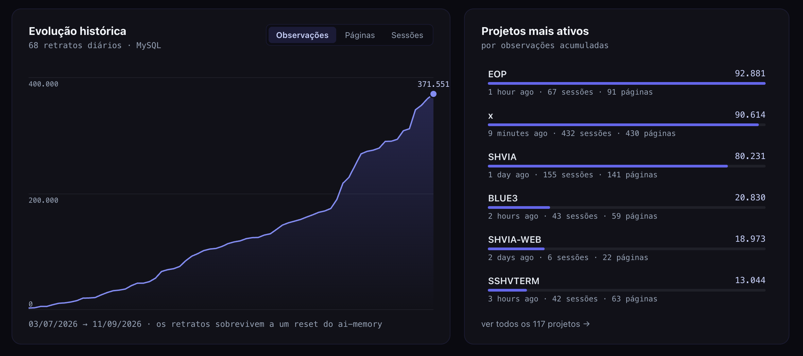
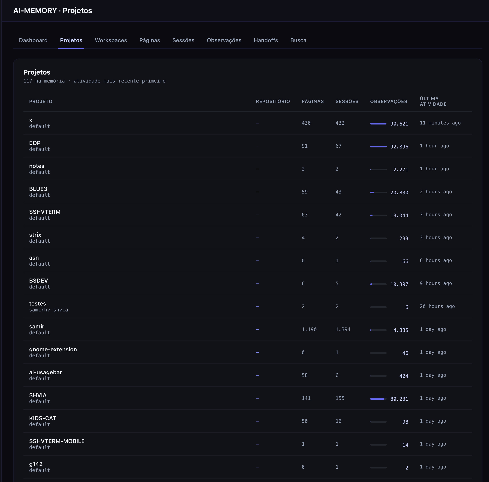
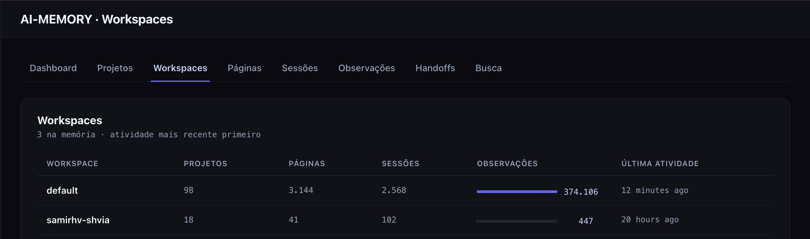
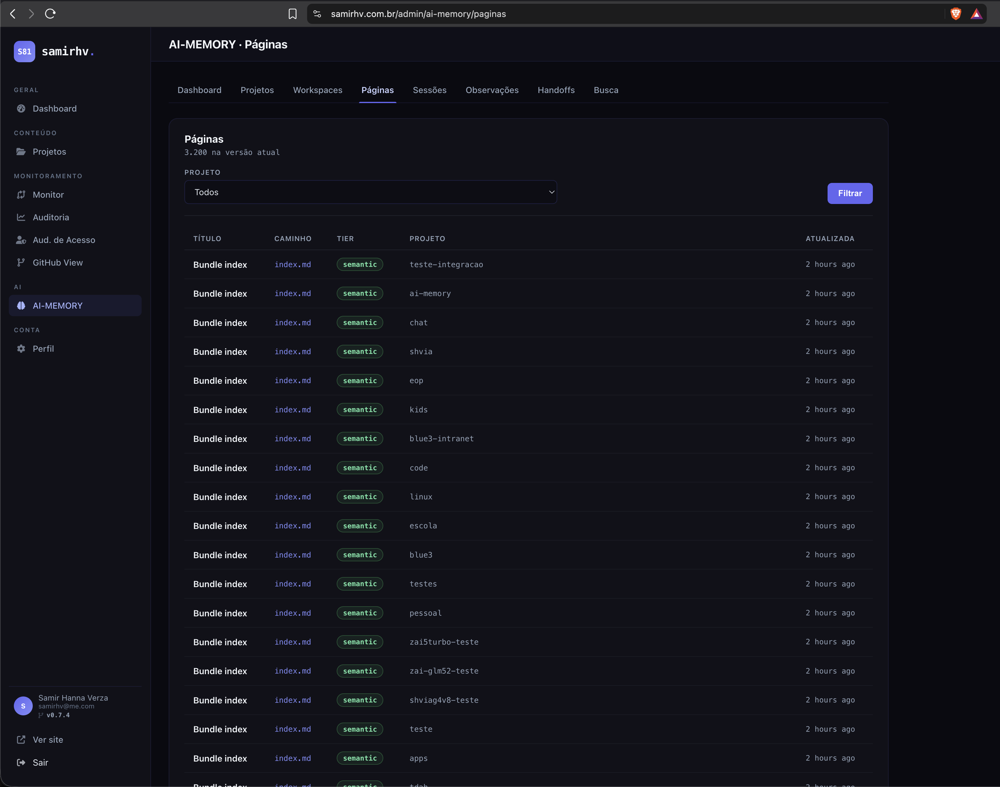
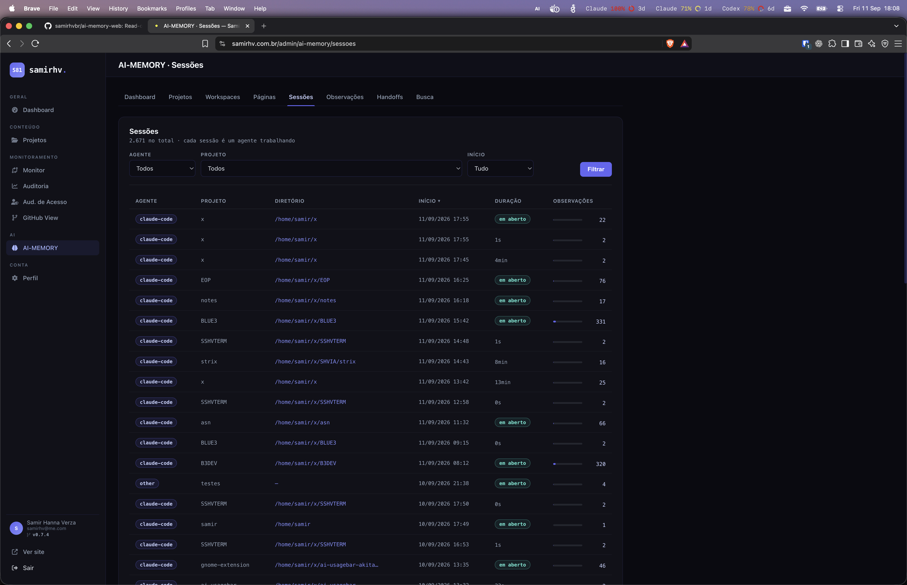
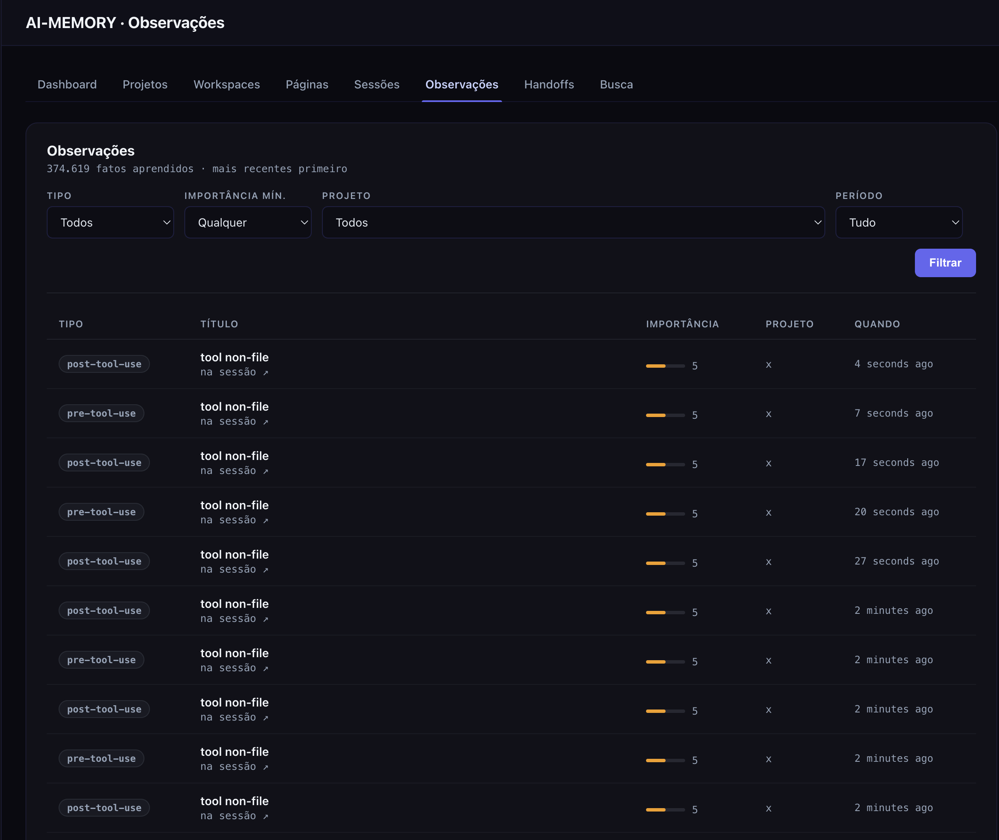
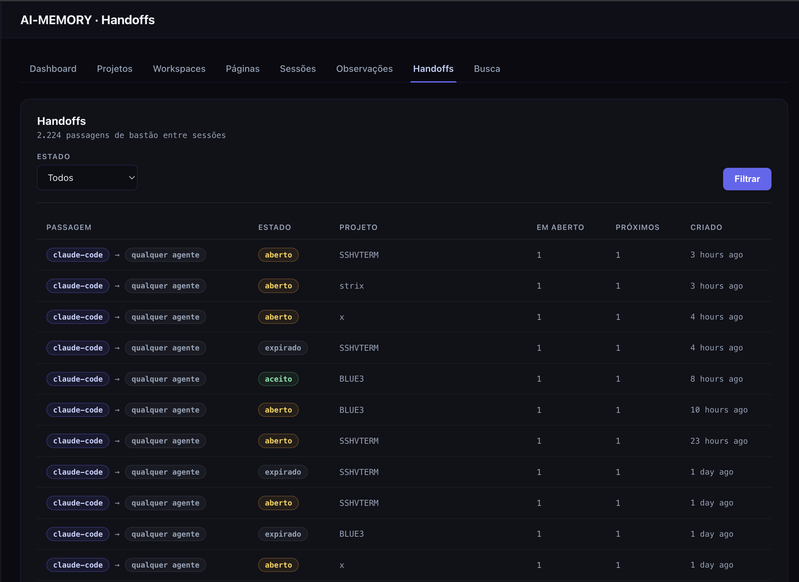
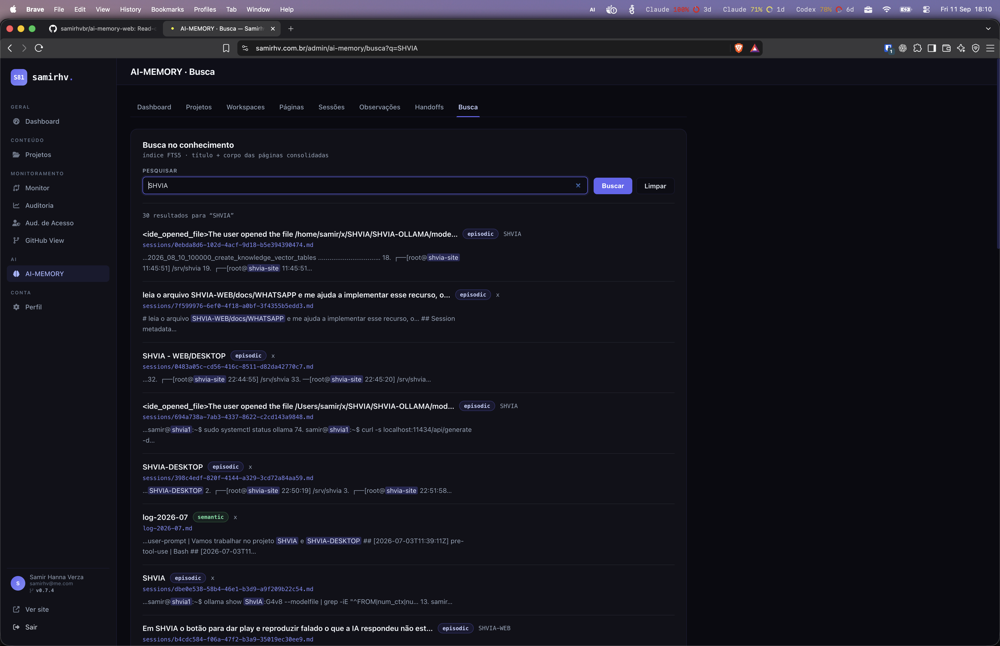

# ai-memory-web

> **Status:** `ACTIVE`

**See what your coding agents remember.**

A **read-only web panel** over the SQLite index of
[ai-memory](https://github.com/akitaonrails/ai-memory) — the long-term memory of
coding agents (Claude Code, Codex, and friends). It answers two questions:
**what did the agents remember**, and **how was it collected**.

[](docs/screenshots/dashboard.png)

*Memory totals and daily activity at a glance.*

[Getting started](#getting-started) · [Full screenshot gallery](docs/screenshots/README.md)

> These captures show the Portuguese AI-MEMORY integration in the author's site,
> from which this standalone app was extracted. The standalone app uses English
> and its own navigation; the surrounding site sidebar is not included.

<details>
<summary><strong>Explore the interface — history, projects, knowledge and search</strong></summary>

### History and active projects

Follow memory growth over time and compare the most active projects.



### Projects

Browse projects and compare their pages, sessions and observations.



### Workspaces

See how collected memory is distributed across workspaces.



### Knowledge pages

Browse consolidated knowledge pages by project and memory tier.



### Agent sessions

Inspect agent activity, duration and the observations collected in each session.



### Observations

Filter individual observations by type, importance, project and period.



### Handoffs

Review context transfers between agents and their current status.



### Search

Find remembered knowledge through full-text search with matching excerpts.



</details>

## How it works

Nine screens over one database it never writes to: a dashboard with live totals
and a durable history, projects, workspaces, the consolidated wiki pages and
their version history, sessions and the facts each one learned, handoffs, and
full-text search through ai-memory's own FTS5 index.

```
┌──────────────────────── one host ────────────────────────┐
│                                                           │
│  ai-memory-web  ──reads (RO, query_only)──►  memory.sqlite│
│   [Laravel]                                   (WAL)       │
│                                                  ▲        │
│  ai-memory service ──writes (sole writer)────────┘        │
└───────────────────────────────────────────────────────────┘
```

It has to run **on the same machine as ai-memory** — it opens the index file
straight off the filesystem, as a second reader. That coupling is the design,
not an accident ([ADR-001](docs/decisions.md#adr-001)); what it costs, and the
filesystem permission it needs, is [docs/permissions.md](docs/permissions.md).

## Getting started

Requires PHP 8.3+ **with `pdo_sqlite`**, Composer, and an ai-memory install on
the same host. No Node, no build step.

```bash
git clone git@github.com:samirhvbr/ai-memory-web.git
cd ai-memory-web
git config core.hooksPath tools/git-hooks   # once per clone

composer install
cp .env.example .env && php artisan key:generate
touch database/database.sqlite && php artisan migrate

# point it at the ai-memory index on this host
echo 'AI_MEMORY_SQLITE_PATH=/opt/ai-memory/data/db/memory.sqlite' >> .env

# create the one account — there is no sign-up page
php artisan aimemory:user you@example.com --name="Your Name"

php artisan serve     # http://127.0.0.1:8000
```

A daily snapshot keeps the usage history alive across an ai-memory reset. It
needs Laravel's scheduler on the host:

```cron
* * * * * cd /path/to/ai-memory-web && php artisan schedule:run >> /dev/null 2>&1
```

Full walkthrough, deploy and troubleshooting: [docs/runbook.md](docs/runbook.md).

### If it shows "ai-memory is not reachable"

That is the app working as designed, and the notice names the actual failure.
Nine times out of ten it is this: **read permission on `memory.sqlite` is not
enough.** A WAL reader also needs **write** permission on the *directory*,
because it has to create the `-shm`/`-wal` sidecars whenever ai-memory has
checkpointed and closed. SQLite reports that as
*"attempt to write a readonly database"* — on a `SELECT`.

The recipe, and the diagnosis: [docs/permissions.md](docs/permissions.md).

## It never writes

ai-memory is the only legitimate writer of its index: it serialises writes
through a writer actor and maintains FTS5 and invariant triggers inside SQLite.
So the guarantee here is at the engine, not in a convention — the connection is
pinned with `PRAGMA query_only = 1`, the raw connection is private, and a test
attempts a real write and asserts that it throws
([docs/read-only.md](docs/read-only.md)).

The same file also explains the other half: an unreachable index renders an
explanatory notice on every screen, **never an HTTP 500**.

## Documentation

| Path | What it is |
|---|---|
| [docs/what-ai-memory-collects.md](docs/what-ai-memory-collects.md) | **The data** — what ai-memory records, table by table, and which screen reads what |
| [docs/read-only.md](docs/read-only.md) | Why this app may never write, and the two-layer availability guard |
| [docs/permissions.md](docs/permissions.md) | The WAL permission trap, the fix, and how to diagnose it |
| [docs/durable-history.md](docs/durable-history.md) | The daily snapshot that outlives an ai-memory reset |
| [docs/live-dashboard.md](docs/live-dashboard.md) | Why "live" is polling and not a WebSocket |
| [docs/](docs/README.md) | **The record** — the full index, plus decisions, security and the runbook |
| [.continue/](.continue/README.md) | **The queue** — what is still open, and whose call it is |
| [.claude/](.claude/README.md) | What an agent may run here without asking, and why |
| [docs/decisions.md](docs/decisions.md) | **ADRs** — what was decided here and why |
| [CHANGELOG.md](CHANGELOG.md) | **The history** — newest first; each heading is a commit subject |
| [version.md](version.md) | **The single authority on the version.** Every bump becomes a tag and a published Release |

## Contributing

```bash
git pull
git config core.hooksPath tools/git-hooks   # once per clone
composer test
composer lint
```

Write the `CHANGELOG.md` entry, bump `version.md` in the same commit, and commit
with the entry's heading as the subject — `0.1.1 - short description`.
Rules: [docs/versioning.md](docs/versioning.md).

> The guard tests build a real WAL database and drop its directory to `0555`.
> They **skip** where `pdo_sqlite` is absent, or when the process is root — root
> ignores permission bits, so the failure cannot be simulated.

## Relationship to ai-memory

This is an independent panel, not an ai-memory component. It is not affiliated
with, endorsed by, or maintained by the ai-memory project; it just reads the
index. Everything it can ever do is a `SELECT` — approving an Auto Improve
proposal or generating embeddings are *writes*, and those belong to ai-memory's
own HTTP API or MCP ([ADR-002](docs/decisions.md#adr-002)).

There is also a SolidJS frontend served by ai-memory itself
([djalmajr/ai-memory-ui](https://github.com/djalmajr/ai-memory-ui)), which talks
to the read-only `/api/v1` instead of the file. Different trade, same idea.

## Standard

The documentation structure of this repository comes from the fleet standard at
[samirhvbr/repodocs](https://github.com/samirhvbr/repodocs). The norm itself
lives there and is deliberately **not** copied here.

## Language

English (US) for everything — documents, commit messages, pull requests, issues,
code comments **and the UI**. The fleet rule carves out end-user-facing strings
as product i18n for a Brazilian audience; that carve-out does not apply to a
developer tool published publicly, whose operator is also its reader
([ADR-005](docs/decisions.md#adr-005)).

## License

MIT — see [LICENSE](LICENSE).
