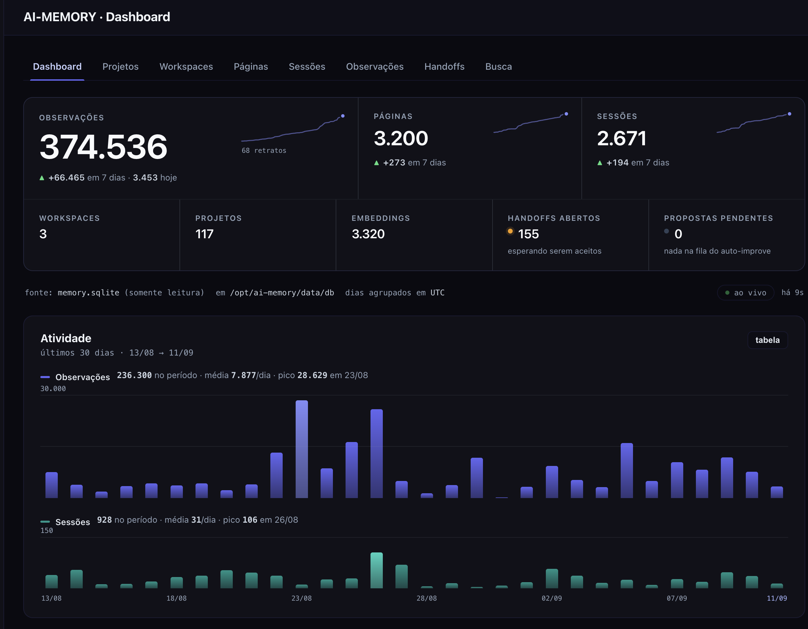

# Interface screenshots

> **Status:** `ACTIVE`

Store screenshots of the running ai-memory-web application in this directory.
No captures have been added yet. This file keeps the directory tracked by Git.

Use descriptive lowercase filenames such as `dashboard.png`, `projects.png`,
`search.png` and `pages.png`. PNG or WebP captures work well for interface text.
Capture the current application, preferably with demonstration data, and check
that credentials or private content are not visible before committing.

When adding a capture, include a short English caption and the application
version or capture date here. Update captures when the corresponding UI changes.
The dashboard can then be embedded near the top of the root README with:

```markdown

```

Inside this directory's README, use the local filename instead:

```markdown

```

Add those image embeds only after the corresponding files exist.
